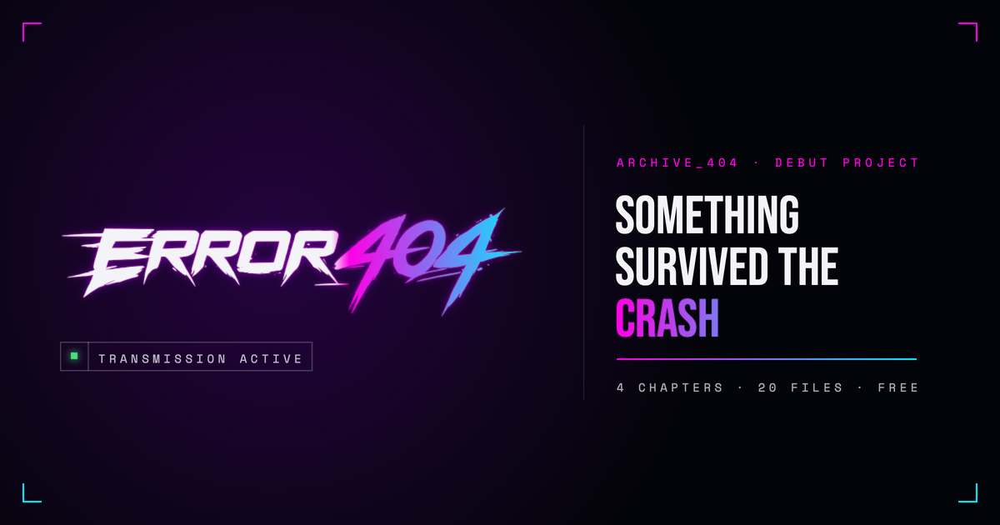
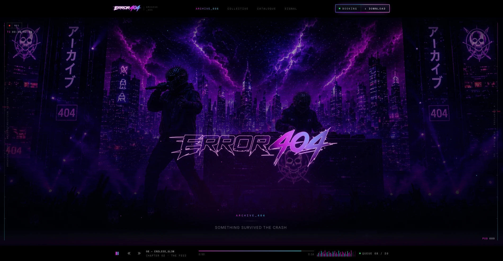
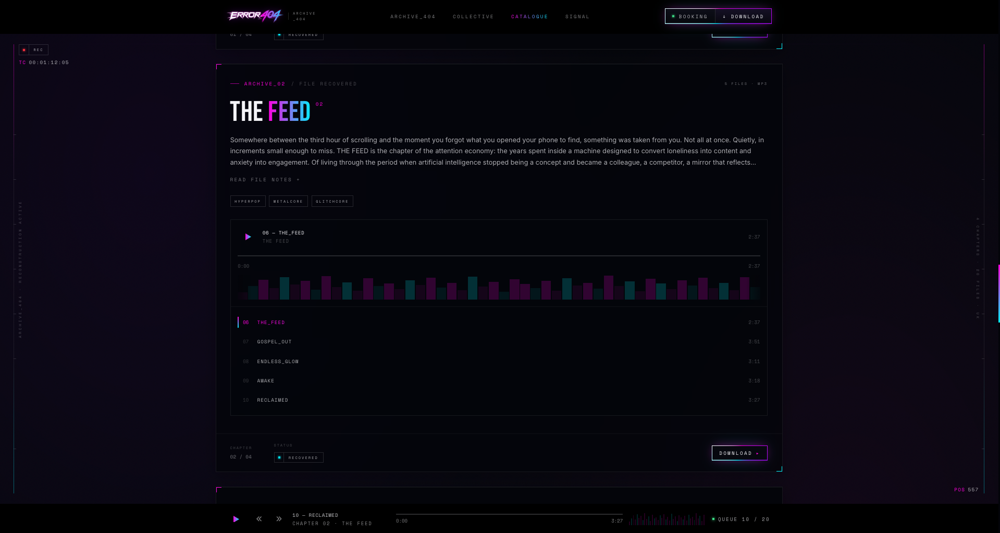
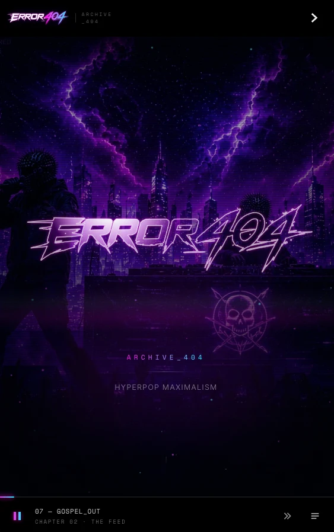

<div align="center">



<br />



<br />

**ARCHIVE_404** — the debut project from **ERROR_404**.<br />
Four chapters. Twenty recovered files. One transmission.

<br />

[](https://error404.run)
[](https://github.com/error404website/error404-website/actions/workflows/ci.yml)
[](https://github.com/error404website/error404-website/releases/latest)
[](https://github.com/error404website/error404-website/releases/latest)
[](LICENSE)
[](#the-archive)

[](#the-archive)
[](#the-archive)
[](https://github.com/error404website/error404-website/releases/latest)
[](https://error404.run)
[](https://error404.run)
[](https://error404.run)
[](https://github.com/error404website/error404-website/commits/main)

[](https://react.dev)
[](https://vitejs.dev)
[](https://motion.dev)
[](https://tailwindcss.com)
[](https://www.netlify.com)

**[▶ error404.run](https://error404.run)** · **[↓ Download the album](https://github.com/error404website/error404-website/releases/latest/download/ARCHIVE_404.zip)** · **[Releases](https://github.com/error404website/error404-website/releases)** · **[Changelog](CHANGELOG.md)**

</div>

<p align="center"></p>

## Screens

<p align="center">
  
</p>

<table>
  <tr>
    <td width="72%"></td>
    <td width="28%"></td>
  </tr>
  <tr>
    <td align="center"><sub>Catalogue: chapter cards with built-in players, and the dock on every page</sub></td>
    <td align="center"><sub>Phone: the hyperpop tagline and the dock</sub></td>
  </tr>
</table>

<p align="center"></p>

## The archive

```
ARCHIVE_404/
├── 01_ORIGIN/
│   ├── 01 origin.mp3 ................. 2:58
│   ├── 02 left_behind.mp3 ............ 4:14
│   ├── 03 graft.mp3 .................. 3:43
│   ├── 04 impacted.mp3 ............... 4:34
│   └── 05 empty_city.mp3 ............. 4:07
├── 02_THE_FEED/
│   ├── 06 the_feed.mp3 ............... 2:37
│   ├── 07 gospel_out.mp3 ............. 3:51
│   ├── 08 endless_glow.mp3 ........... 3:11
│   ├── 09 awake.mp3 .................. 3:18
│   └── 10 reclaimed.mp3 .............. 3:27
├── 03_THE_WRECKAGE/
│   ├── 11 the_wreckage.mp3 ........... 2:29
│   ├── 12 read.mp3 ................... 3:31
│   ├── 13 come_home.mp3 .............. 3:32
│   ├── 14 changed_the_lock.mp3 ....... 4:05
│   └── 15 down_the_front.mp3 ......... 4:07
└── 04_WHOLE/
    ├── 16 whole.mp3 .................. 2:16
    ├── 17 enough.mp3 ................. 4:21
    ├── 18 open_sky.mp3 ............... 3:56
    ├── 19 all_of_me.mp3 .............. 4:07
    └── 20 better_days.mp3 ............ 4:37

20 files · 73:11 · 155 MB · MP3 · ALL INTACT
```

Written and performed by **NULLSAINT** and **CACHEGHOST**. Hyperpop at its core, with metalcore and glitchcore, presented as a recovered transmission.

## What's inside the site

- **Intro, "the tracklist falls"**: matrix code rain whose columns stream the album's own 20 track names, while a terminal readout counts `RECOVERING ARCHIVE_404 · FILE 07/20 GOSPEL_OUT … 20/20 FILES INTACT`, then drains into the hero. About 4 s, once per visit, and a tap or any key skips it.
- **Signal Overload hero**: the logo as an outline cut-out, a self-moving flashlight whose light stays inside the letters, glitch bursts every 4–6 s (magenta/cyan tear, sheared slices, colour-split artwork), scanlines and a VHS tracking band. The tagline scrambles between SOMETHING SURVIVED THE CRASH and **HYPERPOP MAXIMALISM**.
- **Player dock**: one player on every page that plays all 20 tracks in album order, with a queue grouped by chapter, lock-screen and headphone controls, and resume-where-you-left-off. New visitors start on **07 GOSPEL_OUT**.
- **Chapter players**: every chapter streams in the page, with waveform, seek and per-track durations, handing over to and from the dock.
- **Brand kit**: palette (click to copy), typography and press images with downloads.
- **SIGNAL**: a booking form backed by Netlify Forms.
- **End credits** footer, a wide-screen **telemetry gutter** (REC timecode and scroll position) and a branded **404**.
- **One design system**: void black, a strict magenta → cyan duo, Bebas Neue / Space Mono / Inter, holo-foil buttons, gradient play keys, a distressed `>_` menu icon, viewfinder ticks and LED status chips. Everything animates on the GPU, respects Reduce Motion, and scales fluidly on large screens.

<p align="center"></p>

## Development

```bash
npm install
npm run dev            # http://localhost:5173
npm run check          # lint + formatting + production build (what CI runs)
npm run build          # production build into dist/
npm run preview        # serve the build locally
npm run format         # auto-format everything with Prettier
```

Requires Node 22 LTS (see `.nvmrc`).

### Project structure

```
index.html                 page shell: meta/share tags, favicons, fonts, start-up scripts, Netlify form stub
vite.config.js             build config, plus content-hash stamping for logo-fx.js and every track
netlify.toml               build settings, caching and security headers
public/                    copied as-is to the site root
  404.html                 branded "file not found" page
  site.webmanifest         home-screen / Android manifest
  assets/                  logo (SVG), hero art, brand kit, press images, share image,
                           logo-fx.js (hero/closing flashlight, glitch bursts, nav draw-on)
  audio/                   the 20 tracks (snake_case filenames, e.g. changed_the_lock.mp3)
  fonts/                   Bebas Neue (self-hosted)
src/
  main.jsx · App.jsx       entry point and page order
  config.js                GitHub owner/repo and the album download URL
  vault/                     Source Vault page script and styles (the page is vault/index.html)
  components/              BootSequence (intro), Nav, Hero, TaglineSwap, Collective,
                           Catalogue (chapter players), PlayerDock, Signal,
                           DownloadModal, Footer, Gutters, Name
  data/                    chapters.js (tracklist, durations), brand.js (brand kit)
  lib/                     shared easing, time formatting, audioSrc (cache-busted track URLs)
  styles/
    index.css              Tailwind plus the site's base, component and utility layers
    overrides.css          design-system pass (type scale, colours, components); loaded last
.github/                   CI workflow, Dependabot, issue and PR templates
docs/                      README images
```

### Editing the tracklist

Everything lives in [`src/data/chapters.js`](src/data/chapters.js):

```js
{ number: 17, title: "ENOUGH", audioPath: "/audio/enough.mp3", duration: "4:25" }
```

Put the MP3 in `public/audio/` under the same name. CI fails the build if a listed track file is missing.

### Updating the audio

1. Replace the file in `public/audio/`, keeping its snake_case name (e.g. `07 gospel_out.mp3` → `gospel_out.mp3`).
2. Update that track's `duration` in `src/data/chapters.js` if the length changed.
3. Nothing else: each build stamps every track with a hash of its contents (`?v=…`, see `vite.config.js` and `src/lib/audioSrc.js`), so listeners get the new file straight away instead of a copy from their 30-day browser cache.
4. For a new album download, publish a new GitHub Release with the zip (see Deployment). The download button always points at the latest release.

### Developer switches

| Parameter   | Effect                                                                      |
| ----------- | --------------------------------------------------------------------------- |
| `?intro`    | Always play the intro (normally once per visit)                             |
| `?nointro`  | Skip the intro                                                              |
| `?zoom=0.9` | Override the fluid scale (100% up to 1280px wide, easing to 85% at 1920px+) |

<p align="center"></p>

## Deployment

The site deploys automatically on **Netlify** from the `main` branch. `netlify.toml` sets the build (`npm run build` → `dist`, Node 22), long-term caching for hashed bundles, fonts and audio, and security headers.

**The album download** (`ARCHIVE_404.zip`, about 155 MB) is too large for git, so it's attached to the [latest GitHub Release](https://github.com/error404website/error404-website/releases/latest). The site links to `/releases/latest/download/ARCHIVE_404.zip`, so publishing a new release with a new zip updates the download automatically:

```bash
gh release create v1.3.0 ARCHIVE_404.zip --title "ARCHIVE_404 · v1.3.0" --notes-file release-notes.md --latest
```

**Contact form:** submissions arrive under **Netlify → Site → Forms**.

### Source Vault (`/vault/`)

A private page for collaborators: every track's stems, the Suno prompts in all five production styles, original and Suno-optimised lyrics, and each song with its measured length, BPM and key. It opens with the access key, then plays a rain intro that "decrypts" the 20 files.

The page is public code, so the private parts are locked:

| Piece                     | How it's protected                                                                                                                                                                                                                                                          |
| ------------------------- | --------------------------------------------------------------------------------------------------------------------------------------------------------------------------------------------------------------------------------------------------------------------------- |
| Prompts, lyrics, analysis | `public/vault/data.enc.json`, AES-256-GCM with a key derived from **the access key itself** (PBKDF2-SHA256, 300,000 rounds). The browser opens it when the right key is typed; a wrong key can't.                                                                           |
| Stem downloads            | Release `stems` on the private repo `error404website/error404-vault`. `netlify/functions/vault-stems.mjs` hands out GitHub's short-lived signed link, only to a visitor who proves they know the key (checked against `netlify/vault-proof.json`, which holds just a hash). |

**The one Netlify setting:** `VAULT_GH_TOKEN`, a fine-grained GitHub token with access to error404-vault only and **Contents: Read-only** (Site configuration → Environment variables, scope Functions, secret). Without it the page works and stems show SOON.

**Changing the key, prompts or analysis:** edit `.env.vault` (`VAULT_KEY=…`) or the files in `vault-private/` (both git-ignored), run `npm run vault:encrypt`, and commit the two regenerated files.

**Updating the stems:** upload the zips to the `stems` release on the private repo using the names `npm run vault:encrypt` prints (one per track, holding `WAV/` and `MIDI/` folders; ALL STEMS downloads all 20, since even one chapter's zip would pass GitHub's 2 GB cap per release file). Sizes appear in the vault automatically.

**Strength:** the key protects the files like a password on a zip. Someone could copy `data.enc.json` and try guesses offline, so use a long, unusual key if the contents need to stay secret from determined people.

### Live show (`/live/`)

The performance page for playing ARCHIVE_404 live, opened with **the same access key as the vault**. After the key it offers **PRELOAD THE SHOW**: all 20 songs in their live-set versions, twice (with and without vocals), about 350 MB, stored in the browser so the show runs with no network. A pre-show check confirms the files, offline copy, audio output, pads, memory and MIDI.

The show screen (layout M1, lyrics-first) has karaoke lines that fill word by word, stage cues from the prompt notes ("▲ NEXT HOOK · screamed lead · 2 BARS"), a bar/beat counter, the next song with its tempo, key and changeover, and the setlist. The console strip has VOX (a true vocal level: the master crossfades with its instrumental) and CROWD, LOW / MID / HIGH EQ, MASTER, a filter, echo, reverb, crush, roll, tape stop, 1–8-bar loops, REHEARSE (loop the section at 85 %), 16 beat-quantised pads (keys 1–4, Q–R, A–F, Z–V; four of them are vocal chops cut live from the playing song's hooks), PANIC, LOCK (hold to unlock), REC (saves the performance), MIDI learn, and STAGE SCREEN ↗, a second window with big lyrics over the rain for a projector.

| Piece                                                                | Where                                                                                             |
| -------------------------------------------------------------------- | ------------------------------------------------------------------------------------------------- |
| Timeline (songs, lyrics with word timings, cues, beats, MP3 padding) | `public/live/data.enc.json`, AES-256-GCM, key from the access key (PBKDF2-SHA256), like the vault |
| Instrumentals                                                        | `public/live/inst/NN-<hash>.bin`, each AES-256-GCM with its own IV                                |
| Masters                                                              | the site's own `/audio/*.mp3` (the live-set versions)                                             |
| Offline                                                              | `public/live/sw.js` serves the preloaded files from Cache Storage                                 |

Playback is gapless: each MP3 is trimmed to its true samples by finding a stored 64-sample fingerprint in the decode (browsers leave different amounts of MP3 priming), and songs are scheduled back to back on the Web Audio clock.

**Rebuilding the data:** the timeline and instrumentals are made off-repo (lyrics aligned to vocals separated from the masters; the instrumental is the master minus that vocal, rendered on the live set's own seams), then placed in `vault-private/live/` (git-ignored) and locked with `npm run live:encrypt`. The timeline also carries each song's waveform (peak plus low / mid / high energy, 25 points a second) for the waveform strip. Re-running the script keeps the last run's salt and any instrumental that hasn't changed, so a timeline-only update doesn't rewrite the ~170 MB of `.bin` files.

### Notes

- **Fluid scale:** the site is scaled with CSS `zoom` on large screens, and browsers don't rescale `vw`/`vh` under zoom. Size anything full-window as `calc(100vw / var(--ez, 1))`.
- **Search engines and AI:** the site is shared by direct link only. `robots.txt` blocks every crawler (search engines, AI training and AI search, archives, SEO tools), and every response carries `X-Robots-Tag: noindex, nofollow, noarchive, nosnippet, noimageindex, noai, noimageai` (`netlify.toml`), matched by the `robots` meta tag. `tdm-reservation: 1`, `/.well-known/tdmrep.json` and `/ai.txt` opt out of text and data mining. To open the site to search later, remove all of these.
- **Safari toolbar:** Safari 26 tints its toolbars from the fixed nav and the player dock, both `#000000`. It never tints in Private Browsing.
- **Safari clipping:** Safari doesn't clip transformed (GPU-composited) children to `overflow: hidden`. Keep effects inside their box: animate a registered `@property`, a background position or a gradient centre rather than moving an oversized layer, and add `clip-path: inset(0)` when a child must move inside a clip.
- **Icons:** draw UI icons as SVG or CSS shapes. iOS swaps characters like ⏮ ⏭ ☰ ▶ for coloured emoji (▶ is pinned to text with `U+FE0E`).

<p align="center"></p>

<div align="center">

**© 2026 ERROR_404 — all rights reserved.** Public for transparency, not for reuse. See [LICENSE](LICENSE) and [SECURITY.md](SECURITY.md).

</div>
